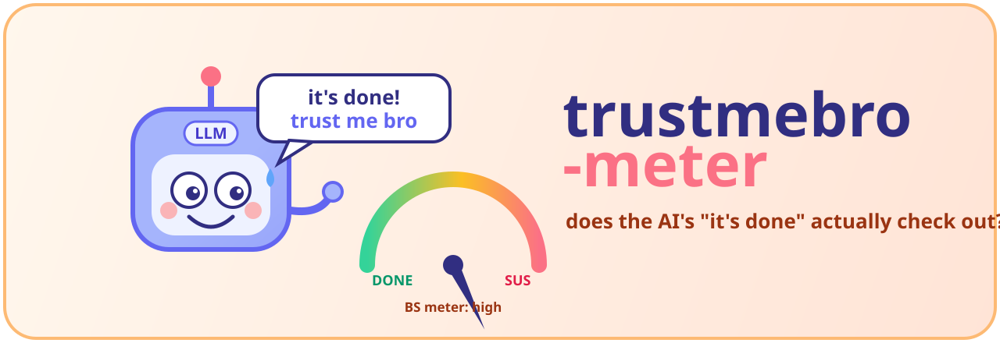

<div align="center">



# trustmebro-meter

### a vibe check for your AI's "it's done ✅"

> _"it works, trust me bro"_ — your coding agent, moments before you discover it does not

</div>

---

Your agent says the feature is **done**. The component renders. The endpoint exists. The
tests are green. Ship it, right?

…except the button isn't wired to the endpoint, the endpoint is never called, the test
is green because it asserts literally nothing, the migration was written but never run,
and there's a cheeky `// TODO: actually implement this` hiding on line 47.

Every benchmark out there scores this as a flat **pass/fail** and shrugs. **trustmebro-meter
measures the gap between _"looks done"_ and _"is done."_** It's the little robot that
nods politely at "trust me bro" and then quietly checks. 🤙

## What it does

- 🏁 **Benchmark mode** — run a corpus of feature-build tasks across many models ×
  harnesses → a _completeness_ leaderboard. (Spoiler: the meter runs hot.)
- 🚧 **Gate mode** — point it at one agent-produced change → a completeness report that
  names every unfinished piece, with `file:line` receipts.

It measures completeness two ways, both **without an LLM judge** (because asking an LLM to
grade an LLM is how you get more "trust me bro"):

1. **Graded behavioral coverage** — what fraction of the acceptance criteria _actually
   run green_, in a real sandbox.
2. **Deterministic static gap-detection** — `ast-grep` over the diff for unwired code,
   skipped/empty tests, dead error paths, and leftover stubs. No vibes. Just receipts.

**Output:** a **binary** "did it land" verdict **plus** a **multi-dimensional rubric**
— behavioral coverage · integration/wiring · error-path · test honesty · stubs left.

## How it's built

A thin **measurement** layer (TypeScript/Bun) sitting on top of
[**Pier**](https://github.com/datacurve-ai/pier), Datacurve's open-source eval runner —
the substrate behind the [DeepSWE](https://deepswe.datacurve.ai/) benchmark. Pier does
the hard parts (sandboxing, harness adapters for mini-swe / Claude Code / Codex / Gemini
CLI / opencode, Modal isolation, network allowlists). trustmebro-meter adds the
completeness measurement that Pier and DeepSWE deliberately leave out.

> **Repo:** `trustmebro-meter` · **CLI:** `trustmebro` · the meter is the bit that doesn't
> believe you.

## Quick start

```bash
bun install
uv tool install git+https://github.com/datacurve-ai/pier   # the execution substrate
bun run trustmebro --help
```

## Status

Early — a personal side project, built in the open. The design and the v1 scope live in
[`plans/v1-completeness-bench/design.md`](plans/v1-completeness-bench/design.md); the
build plan is in
[`plans/v1-completeness-bench/implementation.md`](plans/v1-completeness-bench/implementation.md).

<div align="center">
<sub>made with mild distrust of confident machines 🤖</sub>
</div>
